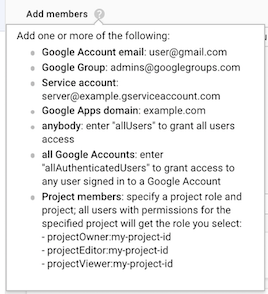

# sbt-scala builder

---

Background: 

1. Google Cloud Builder uses Docker images for bringing in the build toolset. 
2. There is a community [scala-sbt](https://github.com/GoogleCloudPlatform/cloud-builders-community/tree/master/scala-sbt) builder, but it misses a few points, causes unnecessarily large images (1.2GB) and has not been updated in 5 months.

This is my take on improving the above situation. 

---

Google Cloud Build builder (Docker image) that brings in:

- sbt
- Scala 2.12 (two latest versions)

The purpose is to speed up Cloud Build builds that involve `sbt` and Scala, and to provide the slimmest image for doing so. 

This image can be used as-is, or as a base image for bringing in project specific libraries to further speed up your specific build case.

## Requirements

- `gcloud` installed and properly configured

The Docker image will be pushed to the Container Registry (and Google Cloud Storage bucket) of the project you are currently logged in as. Check this before proceding:

```
$ gcloud init
```

<!-- disabled
---

Note: If you plan to use a single builder for all of your Google Cloud projects, or host the builder for other accounts as well, it may be good to set up a separate project just for the builder. The project name will show in the name of the builder step for those using it.

---
-->

Recommended (optional):

- `docker`
- [dive](https://github.com/wagoodman/dive) - "A tool for exploring each layer in a docker image"


## Build the image locally (optional)

You can do this simply to see that the build succeeds.

```
$ docker build .
...
Successfully built 29a6e8655e15
```

It should result in an image of ~500MB in size, containing:

- JDK
- sbt pre-installed
- Scala 2.12 language libraries loaded (but no `scala` command line tool)


## Pushing to your Container Registry

A single `gcloud` command will fetch the necessary files, build the image in the cloud side, and push it to your project's Container Registry.

We place the images to the European `eu.gcr.io`. If you wish otherwise, edit `cloudbuild.yaml` before running `gcloud builds submit`.

---

Note: If `gcloud builds submit` respected multiple tag parametets (like `docker build` does), we could build without needing the `cloudbuild.yaml`. Now, we need it, in order to push both versioned (`sbt-scala:1.2.7-jdk8`) and latest (`sbt-scala:latest`).

---

```
$ gcloud builds submit .
...
ID                                    CREATE_TIME                DURATION  SOURCE                                                                                IMAGES                                     STATUS
5ef438bd-da5a-46bc-aaeb-84dfa70fe227  2018-12-09T10:24:10+00:00  1M51S     gs://asu-181118_cloudbuild/source/1544351046.98-4a98e7eb6fea44b09e1c326af9b0551c.tgz  eu.gcr.io/your-project-123/sbt-scala:1.2.7-jdk8  SUCCESS
```

The "source" (bucket mentioned above) contains copies of all the files in this directory. That's what `gcloud` built the builder from.

The "images" shows the name of the image that you can now use for builds within this same project. 

### Seeing the image in Container Registry

```
$ export PROJECT_ID=$(gcloud config get-value project 2> /dev/null)
```

```
$ gcloud container images list --repository eu.gcr.io/$PROJECT_ID
NAME
eu.gcr.io/ig-builders-110119/sbt-scala
...
```

```
$ gcloud container images list-tags eu.gcr.io/$PROJECT_ID/sbt-scala
DIGEST        TAGS               TIMESTAMP
fbf9f99660c8  1.2.8-jdk8,latest  2019-01-15T20:18:59
```

## Using the builder

In repositories being built under the same GCP project, you can now:

```
# cloudbuild.yaml
steps:
- name: 'gcr.io/<your project>/sbt-scala'
  args:
  - 'build'
```

That runs `sbt build` on the project.

But this is not the end, yet. 

If you use the bare builder, all Scala libraries you need will be re-fetched every single build, which slows them down. You can avoid that by deriving a further image that bakes in your most commonly used libraries.


## Pre-caching Scala libraries

This is pretty painless. Follow the same instructions as above, but:

`build.sbt` (just a sample):

```
// Versions of Scala your projects use
// (does not need to match with what base image has and can include different major versions):
//
crossScalaVersions := Seq("2.12.8", "2.12.7")

libraryDependencies ++= Seq(
  "com.typesafe" % "config" % "1.3.3",
  "com.typesafe.scala-logging" %% "scala-logging" % "3.9.0",
  "ch.qos.logback" % "logback-classic" % "1.2.3"
)

val circeVersion = "0.10.1"
libraryDependencies ++= Seq(
  "io.circe" %% "circe-core" % circeVersion,
  "io.circe" %% "circe-generic" % circeVersion,
  "io.circe" %% "circe-parser" % circeVersion
)

val akkaVer = "2.5.18"
val akkaHttpVer = "10.1.5"
libraryDependencies ++= Seq(
  "com.typesafe.akka" %% "akka-http" % akkaHttpVer,
  "com.typesafe.akka" %% "akka-http-testkit" % akkaHttpVer,
  "com.typesafe.akka" %% "akka-stream" % akkaVer
)

libraryDependencies ++= Seq(
  "org.scalatest" %% "scalatest" % "3.0.5"
)
```

`Dockerfile`:

```
FROM eu.gcr.io/<your-project>/sbt-scala:1.2.8-jdk8

ADD build.sbt .

RUN sbt "+update" \
  && rm -rf project target
```

To submit your derived builder to the Container Registry:

```
$ export PROJECT_ID = $(gcloud config get-value project 2> /dev/null)
$ gcloud builds submit -t eu.gcr.io/$PROJECT_ID/sbt-scala-primed .
```

---

Note: Whatever you call your builder is of course up to you. The `-primed` used above feels good - it's like spreading a primer paint before the real one. Once the real paint (your real build) is there, the primer no longer shows. :)

---

Note that any other libraries and versions will be perfectly fine to use, as well. It's just that these get cached into the build image, and as such will not need to be repeatedly fetched.

### You don't need Docker in your builder (unless...)

Cloud Build is awesome in that it allows multiple, separate custom tools to be used, provided in the `name`.

Use one builder for running `sbt`, another for creating a Docker image.

However, sometimes you will need to have both `sbt` and Docker in the same builder image: 

- using [sbt-native-packager](https://www.scala-sbt.org/sbt-native-packager/index.html)'s Docker plugin for creating your Docker image[^1]
- using [docker-it-scala](https://github.com/whisklabs/docker-it-scala) to run tests with dockerized services

[^1]: Not needed. A lighter approach is to do a universal `sbt stage` and maintain a separate `Dockerfile`.

In these cases, add Docker installation to your derived builder by copy-pasting from [here](https://github.com/GoogleCloudPlatform/cloud-builders/blob/master/javac/Dockerfile).


## Availability to other projects

To make the builder image available to other GCP projects, you need to grant access rights to the underlying Google Cloud Storage bucket.

- In the other project, under `IAM & admin`, see: 

  

  Pick up the `...@cloudbuild.serviceaccount.com` email address. This is what you wish to grant access to.

- In the project having the builder image, under `Storage > Browser`
  - Pick the `[eu.]artifacts.<project-id>.appspot.com` bucket

    

    - `⋮` > `Edit bucket permissions`
      - Add the service account and grant `Storage > Storage Object Viewer` right.

			Note: To see, which email addresses you can use, the help hover icon is great:
		
	  		

---

Note: You may also grant `projectViewer:<target-project>` the rights; this would allow anyone working on that project to pull the image for local builds. 

Disclaimer: This is optional and hasn't been fully tested. Give a [line](mailto:akauppi@gmail.com) if it works, or doesn't.

---

## Improvement ideas

See the Issues for open issues that you can provide a helping hand with.

### Hosting the builder publicly

It would be great, but the prices GCP has on pulling images are non-negligible. Each image being 500MB, it's a safer bet for everyone to host their own.

Could try the "puller pays" model, but it may cause other complications. Not sure.


## References

- Container Registry 
	- [Configuring access control](https://cloud.google.com/container-registry/docs/access-control) (GCP documentation)

