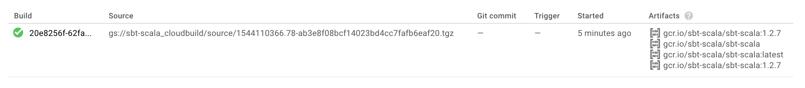
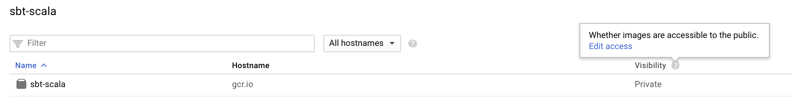

# sbt-scala builder

---

Background: 

1. Google Cloud Builder uses Docker images for bringing in the build toolset. 
2. There is a community [scala-sbt](https://github.com/GoogleCloudPlatform/cloud-builders-community/tree/master/scala-sbt) builder, but it misses a few points and has not been updated in 5 months.
3. Community builders are provided by Google in source mode; you cannot simply use `FROM ...` to use them in your cloud builds.[^1]

This is my take on improving the above situation. 

[^1]: This is completely fine and understandable. It is a slow-down for using Scala projects with Cloud Build, however.

---

Google Cloud Build builder (Docker image) that brings in:

- sbt
- Scala 2.12 (two latest minor versions: eg. 2.12.7, 2.12.6)

The build is intended to be easily available: you can add it to your `FROM ...` in a Dockerfile either as-such for building Scala projects, or as a basis for a custom image that also pre-fetches the libraries you frequent (see below).

The purpose is to speed up Cloud Build builds that involve `sbt` and Scala.

## Building locally

```
$ docker build -t sbt-scala .
...
```

## Pushing to your Cloud Registry

The builder will be pushed to a certain Google Cloud project, so let's begin by checking which one you are logged in with:

```
$ gcloud init
...
```

Then, let Google fetch the files and build it on their side:

```
$ gcloud builds submit --config cloudbuild.yaml .
...
ID                                    CREATE_TIME                DURATION  SOURCE                                                                               IMAGES                                      STATUS
20e8256f-62fa-404c-9e04-4ae528b2b748  2018-12-06T15:32:50+00:00  2M19S     gs://sbt-scala_cloudbuild/source/1544110366.78-ab3e8f08bcf14023bd4cc7fafb6eaf20.tgz  gcr.io/sbt-scala/sbt-scala:1.2.7 (+3 more)  SUCCESS
```

You should see this in Cloud Build > History:



The artefacts created can be seen on the command line:

```
$ gcloud container images list --filter sbt
NAME
gcr.io/<your-project>/sbt-scala
```

The builder is now available for the project you submitted it from. To make it available for all your projects,
which you probably want, or publicly available to anyone, follow this:


### Availability to other specific projects

See [Configuring access control](https://cloud.google.com/container-registry/docs/access-control) (GCP documentation)

### Making it public

Click the "Edit access" here:




---

Note: Google warns that you are eligible for "egress cost" of people using a public image. Let's see how much that is.

Prices vary by destination. The highest (6-Dec-18) is $0.23 per GB (to China). 

Image size is ~200MB. This means $0.05 from you for each time someone (from China) fetches your image.

That's considerable. 

---


## Using in your project

From your project's `cloudbuild.yaml`, you can now:

```
- name: 'gcr.io/<your project>/sbt-scala'
  ...
```


## Pre-caching Scala libraries

The next thing would be to also include your frequently used Scala libraries in a builder image. 

This is pretty painless. Follow the same instructions as here, but:

`Dockerfile`:

```
FROM gcr.io/<your project>/sbt-scala:1.2.7

ADD build.sbt build.sbt

RUN sbt "+update" \
  && rm -rf project target
```

`build.sbt` (just a sample):

```
// Versions of Scala your projects may be using:
//
crossScalaVersions := Seq("2.12.8", "2.12.7")

libraryDependencies ++= Seq(
  "com.typesafe" % "config" % "1.3.3",
  "com.typesafe.scala-logging" %% "scala-logging" % "3.9.0",
  "ch.qos.logback" % "logback-classic" % "1.2.3"
)

libraryDependencies ++= {
  val circeVersion = "0.10.1"
  Seq(
    "io.circe" %% "circe-core" % circeVersion,
    "io.circe" %% "circe-generic" % circeVersion,
    "io.circe" %% "circe-parser" % circeVersion
  )
}

libraryDependencies ++= {
  val akkaVer = "2.5.18"
  val akkaHttpVer = "10.1.5"

  Seq(
    "com.typesafe.akka" %% "akka-http" % akkaHttpVer,
    "com.typesafe.akka" %% "akka-http-testkit" % akkaHttpVer % Test,
    "com.typesafe.akka" %% "akka-stream" % akkaVer
  )
}

libraryDependencies ++= Seq(
  "de.heikoseeberger" %% "akka-http-circe" % "1.22.0",
  "org.scalatest" %% "scalatest" % "3.0.5" % Test
)
```

Something like that. Note that any other libraries and versions will be perfectly fine to use, as well. 
It's just that these get cached into the build image, and as such will not need to be repeatedly fetched.

Enjoy! :)

## Coordinating with the community

If you like this approach, and have time at your hands, it would be appreciated to merge this with the community
approach. It's the place where newcomers to Cloud Build + Scala will come for a solution, and the current
one is not only dated, but also not fully optimized.

The author can be reached at akauppi@gmail.com.
 

## References

- [Google Cloud Build community images](https://github.com/GoogleCloudPlatform/cloud-builders-community) (GitHub) > scala-sbt

- Container Registry > [Configuring access control](https://cloud.google.com/container-registry/docs/access-control) (GCP documentation)

